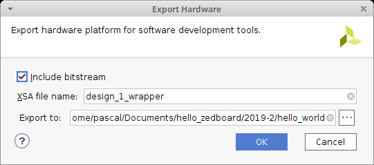
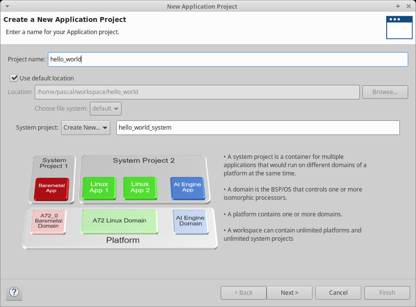
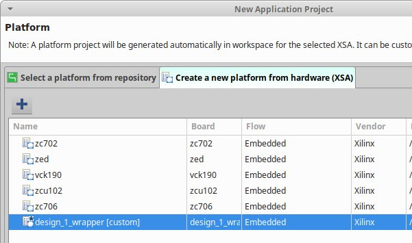
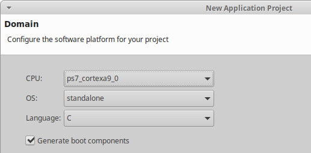
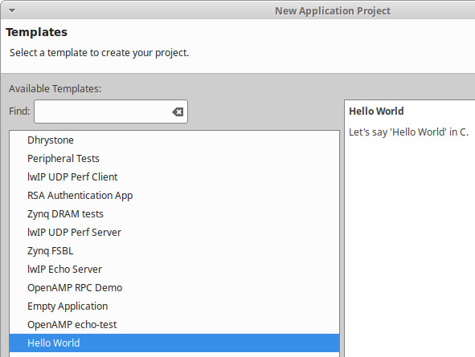
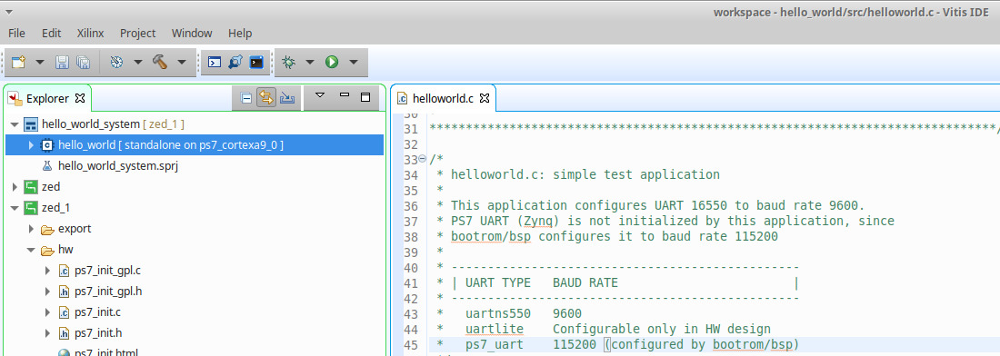
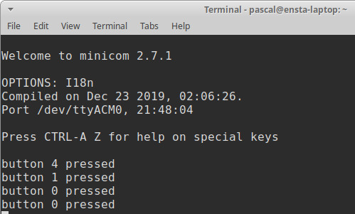

# "Hello world" project for Zedboard - Vivado/Vitis workflow (v2019.2)

> The development of the hardware part is quite similar to this tutorial: https://reference.digilentinc.com/learn/programmable-logic/tutorials/zedboard-getting-started-with-zynq/start

## Hardware part

Open the project file [hello_world.xpr](./hello_world/hello_world.xpr) with Vivado. In a terminal, it can be done with:

```bash
vivado hello_world.xpr
```

And click on **Generate Bitstream** in the left toolbar.

## Software part

Click on **File => Export => Export hardware**. Tick **Include bitstream**.



Click on **Tools => Launch Vitis**. Vitis looks like a fork of Eclipse again. The workflow is quite similar to the usual Xilinx SDK.

Click on **File => New => Application Project** to create a project called **hello_world**:



Click **Next**.



Create a new platform from hardware. Click on the **+** sign and look for the `*.xsa` exported by Vivado. Then, click **Next**.



Select the CPU you want to write code for. In this tutorial, we'll stick with the **ps7_cortexa9_0**. Click **Next**.



Select an **Hello World** project and click **Next**.

Replace the C by the code available in the initial tutorial or in [the repository](../src/helloworld.c).



Right click on the project and select **Program FPGA** to download the bitstream.

Right click again and select **Run as => 1 Launch on Hardware (Single Application Debug)**.

Now, open a terminal and see the magic happen!

